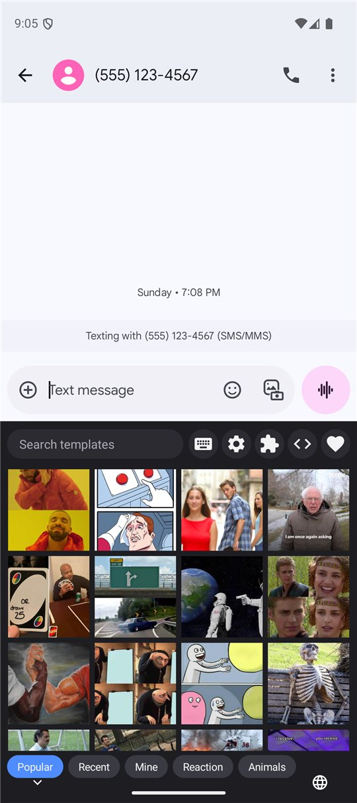
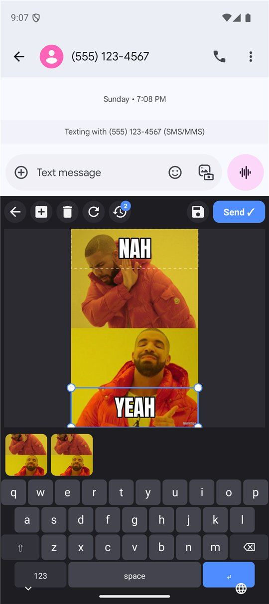
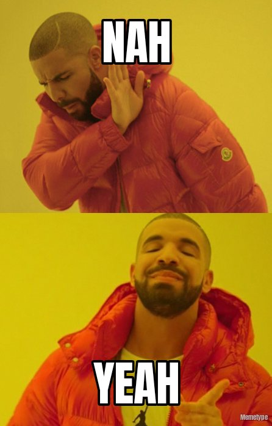

# Memetype

[](https://github.com/xurimx/memetype/actions/workflows/build.yml)
[](https://github.com/xurimx/memetype/releases)

An Android keyboard that makes memes. Switch to it in any chat, pick a template, type the captions on its built-in keyboard, drag the text where you want it and tap **Send**: the finished picture lands in the conversation and your usual keyboard comes back.

<table>
  <tr>
    <td align="center"><br><sub>Pick a template</sub></td>
    <td align="center"><br><sub>Type and place the captions</sub></td>
    <td align="center"><br><sub>Send it</sub></td>
  </tr>
</table>

## Features

- **Templates from several sources.** Imgflip (the 100 most popular templates), memegen.link (about 200 templates with ready-made text layouts), a bundled "Classic memes" pack in the FOSS build, installable template packs (`docs/PACK_FORMAT.md`), and your own pictures: import an image, place the text boxes once, reuse it forever.
- **A real editor.** Any number of text boxes per template; tap to select, drag to move, corner handles to resize, pinch to scale; add, delete or reset boxes. Each template remembers your layout.
- **History.** Reopen a template and your previous captions are one tap away (up to 30 per template).
- **Saves what you send** to `Pictures/Memetype` or a folder you choose, with an optional small watermark, plus a Save button for memes you do not send.
- **Works everywhere.** Apps that accept images get the PNG inserted directly; anywhere else it is copied to the clipboard.
- **Optional Imgflip sign-in** unlocks Imgflip's premium search. Credentials stay in the app's private storage and are excluded from backups.
- **No ads, no tracking, no analytics, no account of its own.** Memetype never records what you type in other apps.

Requires Android 9 or newer.

## Using it

1. Open **Memetype** from the launcher: *Enable keyboard* takes you to the system keyboard list; *Select keyboard* opens the picker.
2. In any chat, tap the keyboard-switcher (globe) icon in the navigation bar and pick *Memetype*.
3. Tap a template, type (↵ moves to the next box; on the last box it sends), drag boxes if you like, then **Send ✓** or the Save icon.
4. The gear in the grid's top row opens Settings (save folder, watermark, history, sources); the puzzle icon opens Sources (switch sources on and off, import a pack zip or a picture, sign in to Imgflip).

Downloads: https://github.com/xurimx/memetype/releases

## Build

Open the folder in Android Studio 2026.1 or newer and let it sync; its bundled JDK runs the build. `local.properties` (git-ignored) needs `sdk.dir=C\:/path/to/Android/Sdk`.

```
.\gradlew.bat :app:installFossDebug        # day-to-day
.\gradlew.bat :app:assembleFossRelease     # signed APK for GitHub / F-Droid
.\gradlew.bat :app:bundlePlayRelease       # .aab for Google Play
```

| Flavour | Bundled "Classic memes" pack | Donate link | For |
|---|---|---|---|
| `foss` (default) | yes | yes | GitHub releases, F-Droid |
| `play` | no — templates come from the online sources | no | Google Play |

Release builds are signed with the upload key described in `keystore.properties.example` (copy to `keystore.properties`, git-ignored); without it they are unsigned. The two GitHub Actions workflows (`build`, `release`) are started by hand from the Actions tab; `release` takes an optional tag such as `v0.4` to publish a GitHub Release, and signs the APK when the `UPLOAD_*` secrets are set. To regenerate the bundled pack run `powershell -ExecutionPolicy Bypass -File tools\fetch-templates.ps1`.

Architecture, project layout and testing notes: [`CLAUDE.md`](CLAUDE.md).

## Credits and licences

- Text-box layouts and template metadata: [memegen.link](https://github.com/jacebrowning/memegen) (MIT).
- Template images belong to their creators and are distributed as widely shared meme templates; each template carries its source link. Online templates are fetched from Imgflip and memegen.link when used.
- Font: Anton (SIL Open Font License), shipped as `assets/fonts/impact.ttf` with its licence.
- Icons: Material Icons (Apache-2.0).
